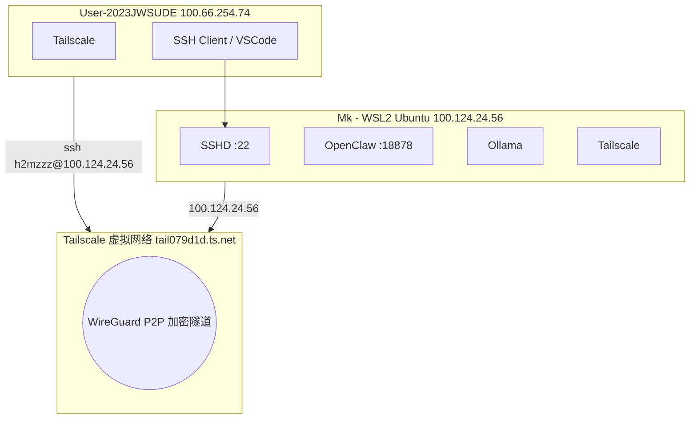
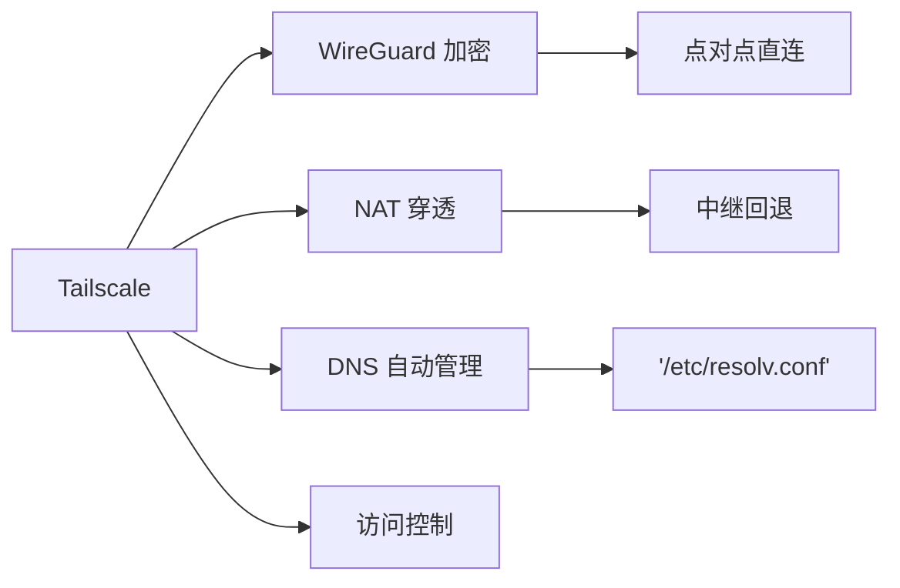

# Tailscale 使用指南

## 总览

Tailscale 是一个基于 WireGuard 的 P2P VPN，用于将多台设备组成一个安全的虚拟局域网。

## 命令速查

### 基础操作

| 命令 | 说明 |
|------|------|
| `sudo tailscale up` | 启动并登录 Tailscale |
| `sudo tailscale up --reset` | 强制重新认证 |
| `sudo tailscale up --ssh` | 启用 Tailscale SSH（免密钥管理） |
| `sudo tailscale down` | 断开 Tailscale |
| `sudo tailscale logout` | 登出当前账号 |

### 状态查看

| 命令 | 说明 |
|------|------|
| `tailscale status` | 查看所有在线设备 |
| `tailscale status --json` | JSON 格式详细信息 |
| `tailscale ip -4` | 查看本机 IPv4 地址 |
| `tailscale ip -6` | 查看本机 IPv6 地址 |

### 网络诊断

| 命令 | 说明 |
|------|------|
| `tailscale ping <IP>` | 测试到对端设备的连通性 |
| `tailscale serve status` | 查看 Tailscale Serve 状态 |
| `tailscale whois --self` | 查看本机账号信息 |

### 系统服务

| 命令 | 说明 |
|------|------|
| `sudo systemctl status tailscaled` | 查看 Tailscale 守护进程状态 |
| `sudo journalctl -u tailscaled -n 30` | 查看最近 30 条日志 |

## 核心概念速查

## 相关笔记

### Concepts
- [[tailscale/concepts/tailscale-core-principles|核心原理]]
- [[tailscale/concepts/tailscale-ssh-vs-traditional|Tailscale SSH vs 传统 SSH]]

### Setup
- [[tailscale/setup/install-and-login|安装与登录]]
- [[tailscale/setup/ssh-connection-setup|SSH 连接配置]]

### Troubleshooting
- [[tailscale/troubleshooting/dns-resolv-conf-override|DNS 被 Tailscale 接管]]
- [[tailscale/troubleshooting/tailscale-offline-reauth|离线重连]]
- [[tailscale/troubleshooting/cross-tailnet-connection|跨 Tailnet 连接问题]]

---

**创建日期**: 2026-05-01
**最后更新**: 2026-05-01
**版本**: 1.0
