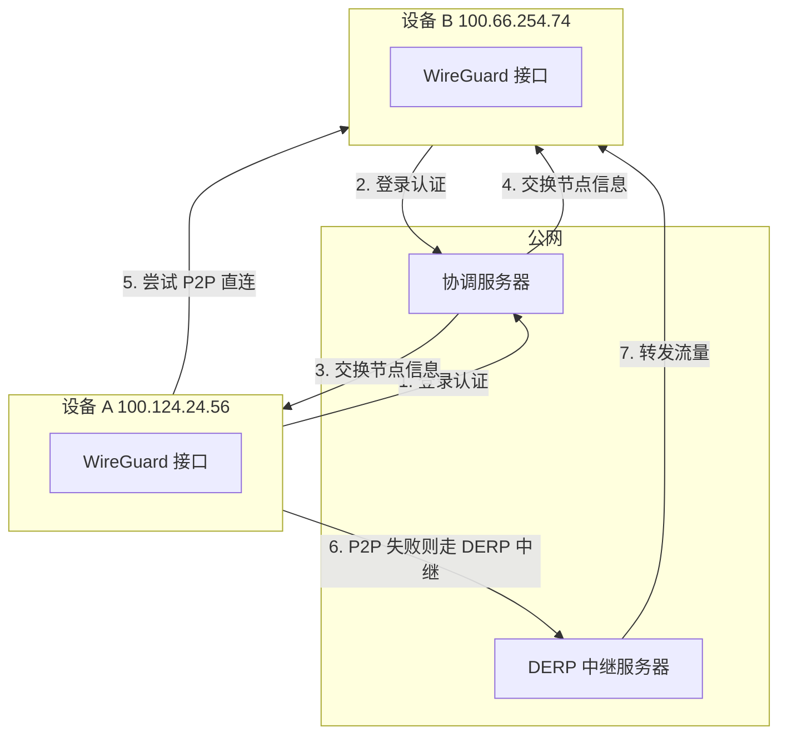
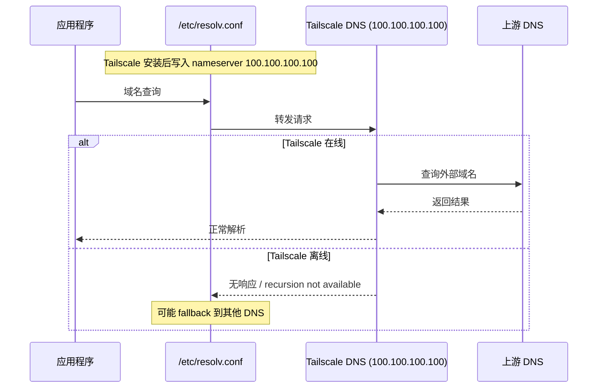
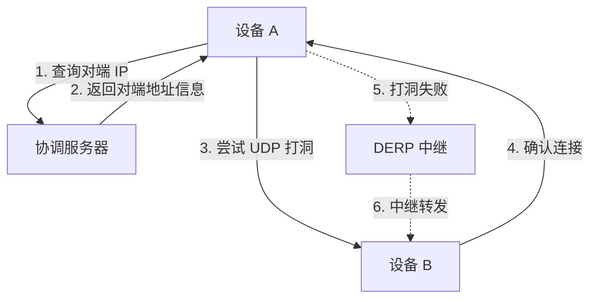

# Tailscale 核心原理

## 概念

Tailscale 是一个基于 **WireGuard** 的 **P2P VPN** 服务，它将多台设备组织成一个加密的虚拟局域网。

## 核心机制

### 1. WireGuard 加密

- 现代、高效的内核级 VPN 协议
- 每对设备之间建立独立的加密隧道
- 端到端加密，中间节点无法解密

### 2. NAT 穿透

- 自动检测 NAT 类型
- 使用 UDP 打洞技术建立直连
- 如果直连失败，自动回退到 DERP 中继

### 3. MagicDNS

### 4. 设备间通信流程

## 对比传统 VPN

| 特性 | 传统 VPN | Tailscale |
|------|---------|-----------|
| 配置复杂度 | 高（证书、路由表等） | 低（一条命令） |
| 需要公网 IP | 通常需要 | 不需要 |
| 连接方式 | 客户端-服务器 | P2P 直连 |
| 中继 | 不常用 | DERP 自动中继 |
| 加密 | 多种协议 | WireGuard |
| 访问控制 | 手动配置 | ACL 集中管理 |

## 适用场景

- **远程 SSH**：从外网访问家中/公司机器
- **私有服务暴露**：通过 Tailscale Serve/Funnel 暴露本地服务
- **跨设备文件传输**：scp/syncthing over Tailscale
- **远程开发**：VSCode Remote SSH over Tailscale

## 相关笔记

- [[tailscale/concepts/tailscale-ssh-vs-traditional|Tailscale SSH vs 传统 SSH]]
- [[tailscale/troubleshooting/dns-resolv-conf-override|DNS 被 Tailscale 接管]]

---

**创建日期**: 2026-05-01
**最后更新**: 2026-05-01
**版本**: 1.0
