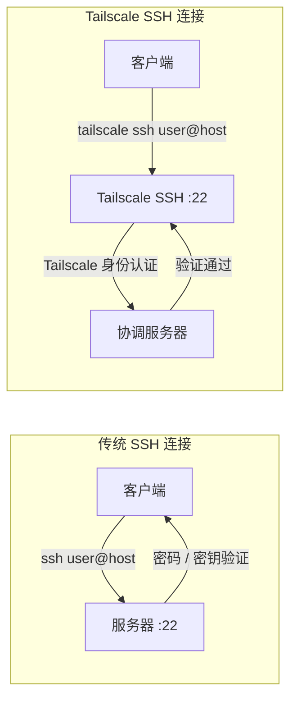
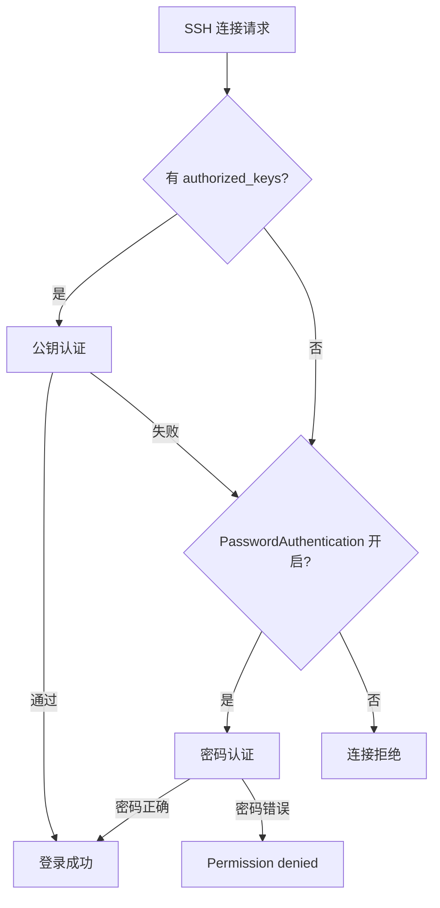

# Tailscale SSH vs 传统 SSH

## 概念

传统 SSH 和 Tailscale SSH 都是远程登录协议，但认证机制和网络路径不同。



## 对比

| 特性 | 传统 SSH | Tailscale SSH |
|------|---------|---------------|
| 认证方式 | 密码 / SSH Key | Tailscale 账号身份 |
| 密钥管理 | 手动生成、分发、轮换 | 自动管理 |
| 网络依赖 | 需要可达 IP | 依赖 Tailscale 网络 |
| 配置复杂度 | 中（需要配 authorized_keys） | 低（`--ssh` 参数即可） |
| 安全性 | 依赖密钥强度 | 基于 OAuth2 身份 |
| 适用场景 | 通用 SSH 访问 | Tailscale 网络内设备 |

## 传统 SSH 配置（推荐方式）

### 生成密钥
```bash
ssh-keygen -t ed25519
```

### 复制到目标机器
```bash
ssh-copy-id h2mzzz@target-ip
```

### 连接
```bash
ssh h2mzzz@100.124.24.56
```

### 目录权限要求
```bash
chmod 700 ~/.ssh
chmod 600 ~/.ssh/authorized_keys
```

## Tailscale SSH

### 在目标机器启用
```bash
sudo tailscale up --ssh
```

### 连接
```bash
tailscale ssh h2mzzz@mk
# 或传统方式
ssh h2mzzz@mk.tail079d1d.ts.net
```

## 密码认证说明



> 密码和 `sudo` 用的是**同一个用户密码**，区别只是 `sudo` 额外获取了 root 权限。

## 相关笔记

- [[tailscale/concepts/tailscale-core-principles|核心原理]]
- [[tailscale/setup/ssh-connection-setup|SSH 连接配置]]

---

**创建日期**: 2026-05-01
**最后更新**: 2026-05-01
**版本**: 1.0
