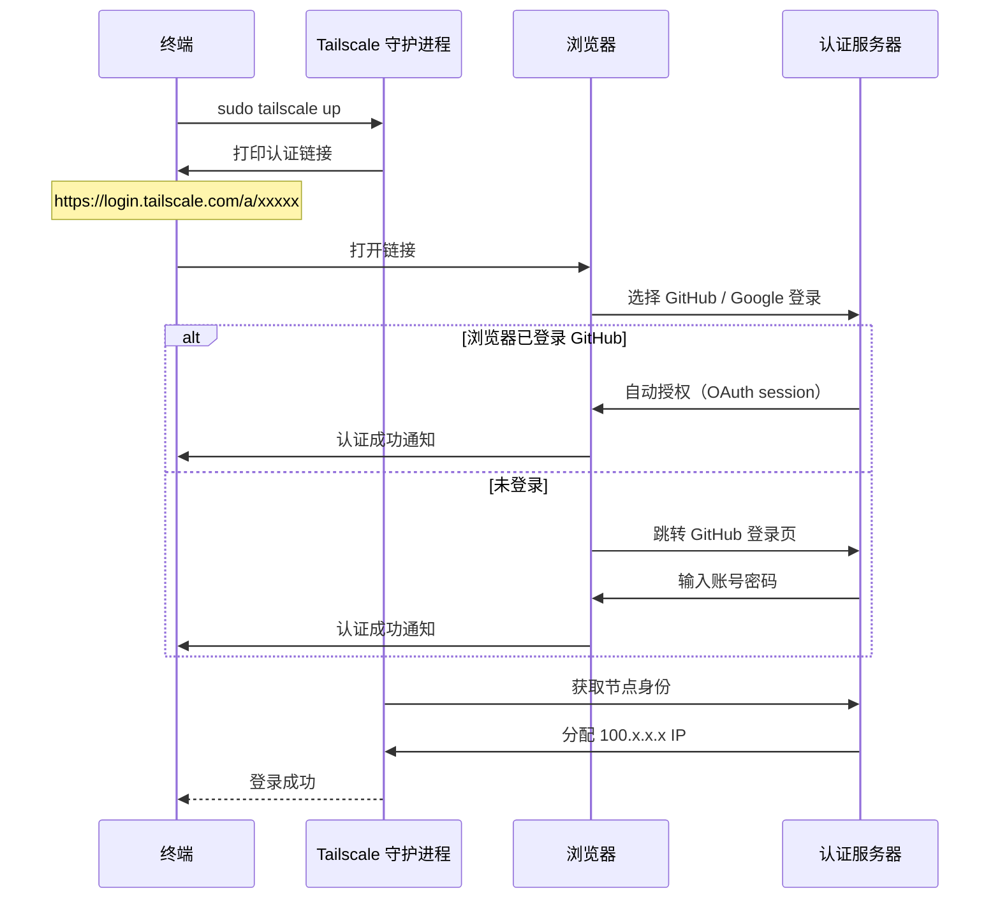
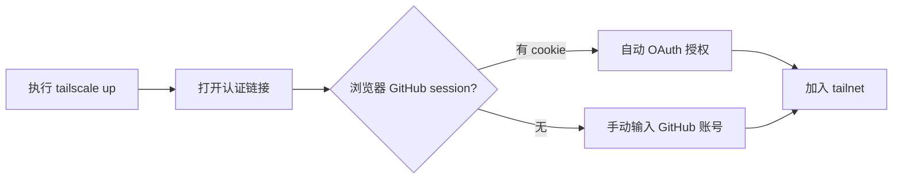

# Tailscale 安装与登录

## 安装

### WSL2 / Linux
```bash
curl -fsSL https://tailscale.com/install.sh | sh
```

### macOS
```bash
brew install tailscale
```

### Windows
从 [https://tailscale.com/download](https://tailscale.com/download) 下载安装包。

## 登录流程



## 自动登录 GitHub 的原因



> 自动使用 GitHub 登录是因为**浏览器里有 GitHub 的登录 session（cookie）**，与 SSH 密钥无关。

## 登录后的验证

```bash
# 查看本机 IP
tailscale ip -4
# 示例输出: 100.124.24.56

# 查看网络状态
tailscale status
# 示例输出: 100.124.24.56  mk  HuaiminHuang@  linux  -
```

## 登录原则

- **所有设备必须使用同一个账号登录**，才会加入同一个 tailnet
- 不同账号的设备互相不可见（除非配置共享）
- `tailscale up --reset` 可强制重新登录

## 常见问题

| 问题 | 原因 | 解决 |
|------|------|------|
| 自动登录了错误的账号 | 浏览器里登录了多个 GitHub 账号 | `sudo tailscale logout` 后重新 `up`，手动选择账号 |
| 两台机器互相找不到 | 用了不同的 GitHub 账号登录 | 确保所有设备用**同一个账号** |
| WSL2 重启后 Tailscale 断连 | WSL2 网络栈重启 | 重新 `sudo tailscale up` |

## 相关笔记

- [[tailscale/setup/ssh-connection-setup|SSH 连接配置]]
- [[tailscale/troubleshooting/tailscale-offline-reauth|离线重连]]

---

**创建日期**: 2026-05-01
**最后更新**: 2026-05-01
**版本**: 1.0
