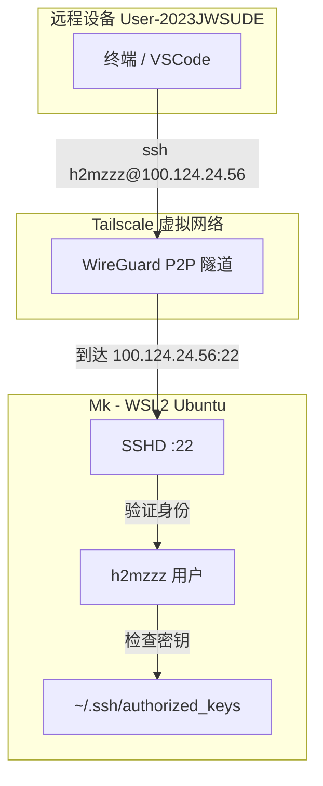

# SSH 连接配置

## 连接拓扑



## 先决条件

1. 两台设备都已安装 Tailscale
2. 使用**同一个账号**登录
3. 目标机器（Mk WSL2）已安装 SSH Server

```bash
# 确保 SSH 已安装并运行
sudo apt install openssh-server
sudo systemctl status sshd
```

## 方式一：密码登录（快速验证）

从远程设备执行：
```bash
ssh h2mzzz@100.124.24.56
```

> 密码是**目标机器上 h2mzzz 用户的密码**，和 `sudo` 密码是同一个。

```mermaid
flowchart LR
    A[远程设备] -->|ssh h2mzzz@100.124.24.56| B[目标机器]
    B -->|输入密码| C[验证通过]
    C -->|进入目标机器环境| D[bash / zsh]
    D -->|看到的是目标机器的| E[/home/h2mzzz 文件系统]
    D -->|用的是目标机器的| F[CPU / 内存 / 网络]
```

## 方式二：密钥登录（推荐）

在**远程设备**上：
```bash
# 1. 生成密钥（如果没有）
ssh-keygen -t ed25519

# 2. 复制公钥到目标机器
ssh-copy-id h2mzzz@100.124.24.56

# 3. 之后免密登录
ssh h2mzzz@100.124.24.56
```

### 如果不支持 ssh-copy-id

手动复制：
```bash
# 在远程设备查看公钥
cat ~/.ssh/id_ed25519.pub

# 在目标机器添加公钥
echo "ssh-ed25519 AAAA..." >> ~/.ssh/authorized_keys
chmod 600 ~/.ssh/authorized_keys
chmod 700 ~/.ssh
```

## 方式三：密码 + 密钥登录问题排查

```bash
# 开启详细日志看认证过程
ssh -vvv h2mzzz@100.124.24.56
```

常见拒绝原因：
- 密码错误 → `Permission denied (password)`
- 密钥不匹配 → `Permission denied (publickey)`
- 都没开启 → `Permission denied (publickey,password)`

## VSCode Remote SSH 配置

1. 安装扩展 `ms-vscode-remote.remote-ssh`
2. `Ctrl+Shift+P` → `Remote-SSH: Open Configuration File...`
3. 添加配置：

```
Host mk-wsl
    HostName 100.124.24.56
    User h2mzzz
    IdentityFile ~/.ssh/id_ed25519
```

4. `Ctrl+Shift+P` → `Remote-SSH: Connect to Host...` → 选 `mk-wsl`

## 退出连接

```bash
exit
# 或 Ctrl+D
```

只是断开 SSH 连接，不影响目标机器的运行。如果用了 `tmux`/`screen`，重连后可恢复会话。

## 常见坑点

| 坑 | 原因 | 解决 |
|------|------|------|
| 连接超时 | 两台不在同一个 tailnet | `tailscale status` 确认互见 |
| Connection refused | sshd 没运行 | `sudo systemctl start sshd` |
| Host key mismatch | 目标机器重装 | `ssh-keygen -R 100.124.24.56` |
| 连上后发现是另一台机器 | 多个设备 IP 搞混了 | 核对 `tailscale status` 输出 |

## 相关笔记

- [[tailscale/setup/install-and-login|安装与登录]]
- [[tailscale/concepts/tailscale-ssh-vs-traditional|Tailscale SSH vs 传统 SSH]]

---

**创建日期**: 2026-05-01
**最后更新**: 2026-05-01
**版本**: 1.0
