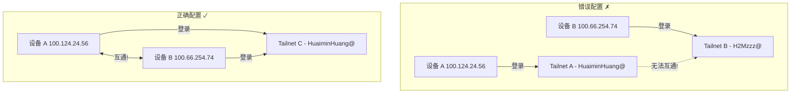
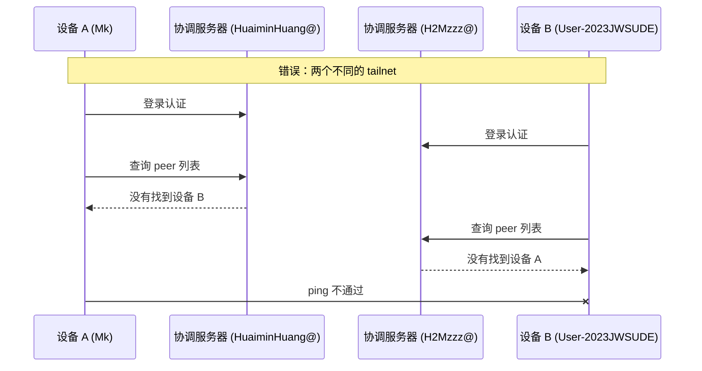
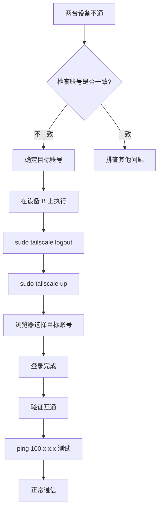

# 跨 Tailnet 连接问题

## 问题描述

两台设备都安装了 Tailscale，互相 ping 不通（100%丢包），但各自都能显示对方存在。

## 错误信息

```text
# 设备 A
tailscale status
100.124.24.56  mk               HuaiminHuang@  linux  -
100.66.254.74  user-2023jwsude  H2Mzzz@        linux  -

# ping 设备 B
ping 100.66.254.74
# 100% packet loss
```

## 环境信息

- 设备 A: Mk (WSL2) - 账号 HuaiminHuang@
- 设备 B: User-2023JWSUDE - 账号 H2Mzzz@
- 两台设备都显示已安装 Tailscale 并登录

## 诊断过程

### 1. 问题定位

```bash
# 分别查看两台设备的账号信息
tailscale status

# 查看 tailnet 名称
tailscale status --json | python3 -c "
import sys,json
d=json.load(sys.stdin)
print('Tailnet:', d.get('CurrentTailnet',{}).get('Name'))
print('User:', d.get('Self',{}).get('UserName'))
"

# 测试连通性
ping 100.66.254.74
```

### 2. 根本原因分析





## 解决方案

### 在一台设备上重新登录（统一账号）

在**其中一台设备**上执行：

```bash
# 1. 登出当前账号
sudo tailscale logout

# 2. 重新登录，选择与另一台设备相同的账号
sudo tailscale up
```

浏览器弹出后，选择**和目标设备相同的 GitHub 账号**登录。



## 验证步骤

```bash
# 1. 确认两台设备都在同一 tailnet
tailscale status
# 应显示同一个账号

# 2. 测试连通性
ping 100.66.254.74
# 应正常收到 pong

# 3. SSH 连接测试
ssh h2mzzz@100.124.24.56
# 应能正常登录
```

## 防止再次发生

- 安装 Tailscale 时注意浏览器使用的账号
- 建议所有设备使用同一个 GitHub 账号注册 Tailscale
- 如果使用不同账号，可以用 Tailscale 的共享功能（Share）跨 tailnet

## 总结

| 问题 | 解决方法 | 状态 |
|------|----------|------|
| 两台设备 100% 丢包 | 检查是否同一账号登录 | ✅ |
| 不同账号导致的隔离 | `sudo tailscale logout` → `up` 重新选账号 | ✅ |

## 相关笔记

- [[tailscale/setup/install-and-login|安装与登录]]
- [[tailscale/troubleshooting/tailscale-offline-reauth|离线重连]]

---

**文档创建**: 2026-05-01
**最后更新**: 2026-05-01
**版本**: 1.0
