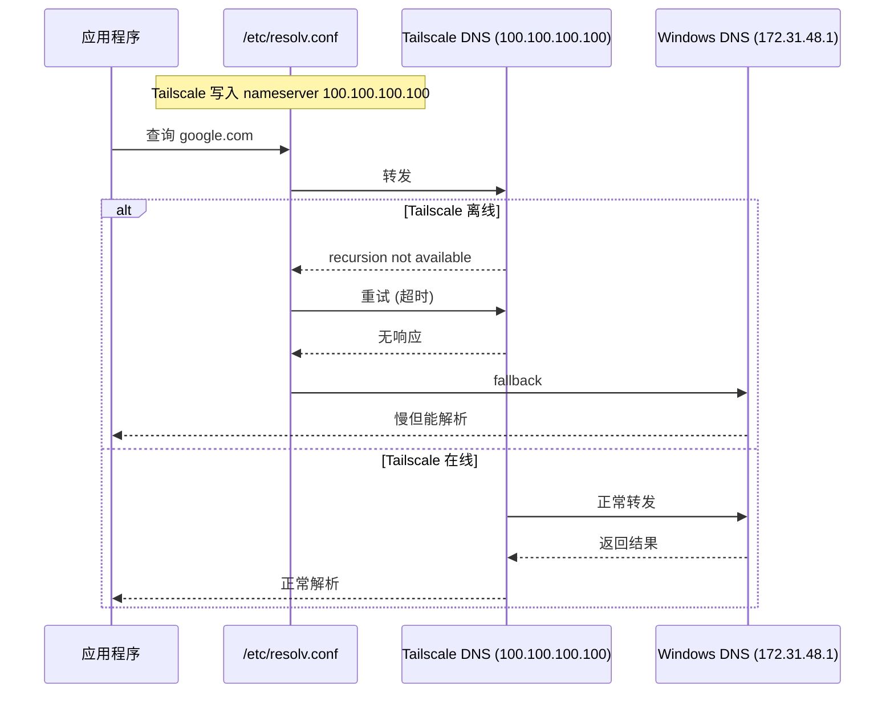

# DNS 被 Tailscale 接管（resolv.conf 覆写）

## 问题描述

安装 Tailscale 后，`/etc/resolv.conf` 被自动修改，DNS 指向 Tailscale 的 MagicDNS 服务器。当 Tailscale 离线时，DNS 解析异常。

## 错误信息

```text
# resolv.conf(5) file generated by tailscale
nameserver 100.100.100.100
nameserver fd7a:115c:a1e0::53
search tail079d1d.ts.net
```

DNS 查询表现：
```text
nslookup google.com
;; Got recursion not available from 100.100.100.100, trying next server
```

## 环境信息

- 系统: WSL2 Ubuntu 22.04
- Tailscale: 已安装并运行
- 网络状态: Tailscale offline（无法连接协调服务器）

## 诊断过程

### 1. 问题定位

```bash
# 查看当前 DNS 配置
cat /etc/resolv.conf

# 测试 DNS 解析
nslookup google.com

# 检查 Tailscale 状态
tailscale status
tailscale status --json | python3 -c "import sys,json;d=json.load(sys.stdin);print('Online:',d.get('Self',{}).get('Online'));print('Health:',d.get('Health',[]))"
```

### 2. 根本原因分析




## 解决方案

### 方案 1：修复 Tailscale（推荐）

```bash
# 重新认证并上线
sudo tailscale up --reset

# 验证状态
tailscale status
# Online: True, Health: [] 表示恢复正常
```

### 方案 2：恢复 DNS 为 Windows 宿主（临时方案）

```bash
# 查看 Windows 宿主 IP（WSL2 默认网关）
ip route | grep default
# 示例: default via 172.31.48.1 dev eth0

# 手动设置 DNS
echo "nameserver 172.31.48.1" | sudo tee /etc/resolv.conf

# 防止被 Tailscale 再次覆盖
sudo chattr +i /etc/resolv.conf
```

> ⚠️ `chattr +i` 后 Tailscale 无法修改 resolv.conf，但 Tailscale 的 MagicDNS 功能也会失效。

### 方案 3：混合配置（DNS fallback）

```bash
# 同时保留 Tailscale DNS 和 Windows DNS
echo -e "nameserver 100.100.100.100\nnameserver 172.31.48.1" | sudo tee /etc/resolv.conf
```

## 验证步骤

```bash
# 测试 DNS 解析
nslookup google.com

# 确认没有 recursion not available 错误
# 确认响应时间正常

# 确认网络连接正常
ping 100.124.24.56
```

## 预防措施

- 定期检查 Tailscale 状态：`tailscale status`
- 如果使用 WSL2，确保 Windows 上的 Tailscale 也正常运行
- 监控 DNS 响应时间，及时发现异常

## 总结

| 问题 | 解决方法 | 状态 |
|------|----------|------|
| DNS 被 Tailscale 接管且离线 | `tailscale up --reset` 重连 | ✅ |
| DNS 解析慢/失败 | 恢复 Windows DNS 或混合配置 | ✅ |

## 相关笔记

- [[tailscale/troubleshooting/tailscale-offline-reauth|离线重连]]
- [[tailscale/concepts/tailscale-core-principles|核心原理]]

---

**文档创建**: 2026-05-01
**最后更新**: 2026-05-01
**版本**: 1.0
