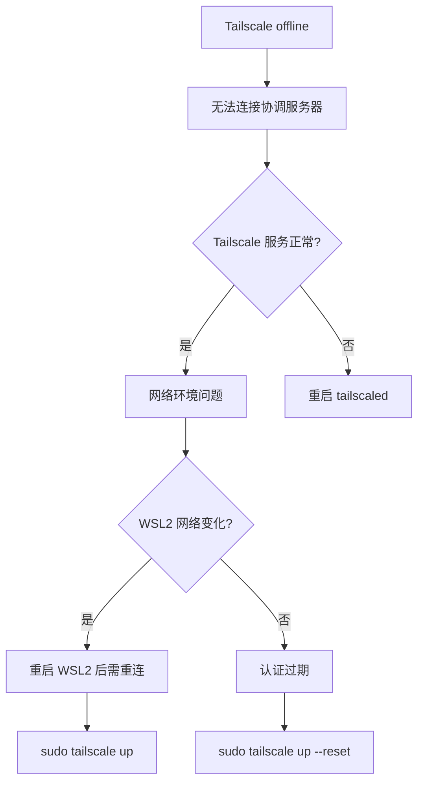
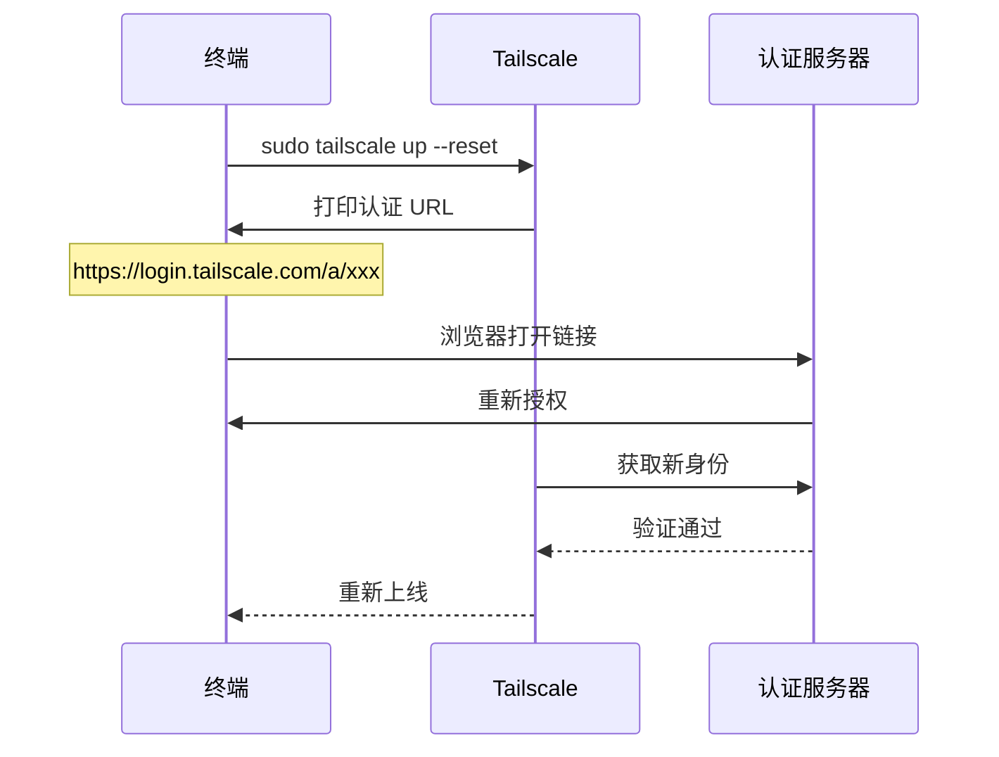

# Tailscale 离线重连

## 问题描述

Tailscale 处于 offline 状态，无法连接到协调服务器，设备之间无法通信。

## 错误信息

```text
tailscale status
100.124.24.56  mk  HuaiminHuang@  linux  offline

# Health check:
#     - Unable to connect to the Tailscale coordination server
#       to synchronize the state of your tailnet.
#       Peer reachability might degrade over time.
```

## 环境信息

- 系统: WSL2 Ubuntu 22.04
- Tailscale 版本: 最新
- 网络: WSL2 通过 Windows 宿主上网

## 诊断过程

### 1. 问题定位

```bash
# 查看详细状态
tailscale status --json

# 查看守护进程日志
sudo journalctl -u tailscaled -n 30
```

### 2. 根本原因分析



## 解决方案

### 方案 1：简单重连

```bash
sudo tailscale up
```

如果 WSL2 网络刚重启，这会重新建立连接。

### 方案 2：强制重新认证

```bash
sudo tailscale up --reset
```

这会清除旧的认证信息，要求重新在浏览器登录。



### 方案 3：检查守护进程

```bash
# 查看服务状态
sudo systemctl status tailscaled

# 如果服务异常，重启
sudo systemctl restart tailscaled

# 查看日志排查
sudo journalctl -u tailscaled --no-pager -n 50
```

## 验证步骤

```bash
# 确认状态
tailscale status
# 应显示为: 100.124.24.56  mk  HuaiminHuang@  linux  -

# 检查 JSON 状态
tailscale status --json | python3 -c "
import sys,json
d=json.load(sys.stdin)
print('Online:', d.get('Self',{}).get('Online'))
print('BackendState:', d.get('BackendState'))
print('Health:', d.get('Health',[]))
"
# 期望输出: Online: True, BackendState: Running, Health: []

# 验证连通性
ping 100.66.254.74
```

## 预防措施

- WSL2 重启后，记得执行 `sudo tailscale up` 重连
- 如果经常断连，考虑在 Windows 上安装 Tailscale 而不是 WSL2 内

## 总结

| 问题 | 解决方法 | 状态 |
|------|----------|------|
| Tailscale offline | `sudo tailscale up` | ✅ |
| 认证过期/错误 | `sudo tailscale up --reset` | ✅ |
| 服务异常 | `sudo systemctl restart tailscaled` | ✅ |

## 相关笔记

- [[tailscale/troubleshooting/dns-resolv-conf-override|DNS 被 Tailscale 接管]]
- [[tailscale/concepts/tailscale-core-principles|核心原理]]

---

**文档创建**: 2026-05-01
**最后更新**: 2026-05-01
**版本**: 1.0
